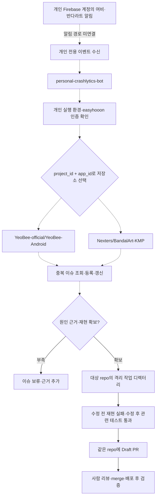

# Personal Crashlytics bot

여비·반다라트의 크래시 대응 자동화를 관리하는 전용 저장소다.

**현재는 운영 상태와 연결 계획을 정리한 단계다. 자동 이슈 등록·분석·수정 PR·runner는 아직 활성화하지 않았다.**

## 확인 결과 — 2026-10-07

| 항목 | 확인 결과 |
| --- | --- |
| GitHub 쓰기 계정 | `easyhooon` |
| Firebase 계정 | 개인 운영 계정; 2026-10-06 앱 metadata·Crashlytics 읽기 HTTP 200 기록 확인. 이번에는 재조회하지 않음 |
| 기존 로컬 설정 | 두 target 모두 `enabled=false`, `live_enabled=false` |
| GitHub 앱 저장소 workflow | 일반 CI·release·issue branch·PR 운영 workflow만 확인. 크래시 알림 처리 workflow 없음 |
| 실제 크래시 대응 자동화 | 알림 연결·무인 인증·실제 수정/test producer·PR 게시 미연결 |

기존 Crashlytics SDK 관련 이슈나 PR도 앱의 SDK 연동·수정 이력이며 이 자동화의 운영 증거가 아니다.

## 대상

| 앱 | Android Firebase project | Production app ID | GitHub 저장소 | 현재 base branch |
| --- | --- | --- | --- | --- |
| 여비 | yeobeeios | 1:434182132125:android:5f42e801adcc2624631f74 | YeoBee-official/YeoBee-Android | develop |
| 반다라트 | bandalart-e0288 | 1:197590766195:android:0e0a78d2390e6849179006 | Nexters/BandalArt-KMP | main |

여비의 project 이름에 `ios`가 있지만 표의 app ID는 Android다. 현재 확인 범위는 이 두 production Android 앱이다. iOS 크래시 대응은 별도 대상·검증을 정해야 한다. 기존 iOS 리뷰·통계·매출 알림 작업과 크래시 대응은 각각 상태를 확인한다.

## 연결할 흐름

아래는 목표 흐름이다. 현재 실행 중인 pipeline을 나타내지 않는다.

개인 bot이 해당 앱 저장소를 선택하고, 그 저장소의 코드와 base branch를 기준으로 수정·검증·PR을 만든다. 두 저장소에 같은 원인이 확인되면 각 저장소에서 따로 검증하고 PR도 각각 만든다. 다른 저장소의 테스트 통과를 재사용하지 않는다.

## 다음 구현 순서

1. 개인 알림의 실제 수신 경로를 확인하고 기술 ID만 정규화한다. 메일 원문·사용자 식별자·임의 명령은 실행 입력으로 사용하지 않는다.
2. 두 대상만 허용하는 이슈 동기화와 원격 중복 확인을 구현·테스트한다. 기존 이슈가 있으면 재사용하고 닫힌 이슈를 자동으로 다시 열지 않는다.
3. 개인 실행 환경과 무인 인증을 확인한다. 회사 runner와 인증·상태·로그를 공유하지 않는다. 새 인증이나 runner 설치는 권한·영향을 설명하고 승인받는다.
4. 각 앱의 AGENTS.md·PR template·build/test 정책에 맞는 실제 재현·수정·검증 기록을 만든다. 근거가 부족하면 수정 PR을 보류한다.
5. `easyhooon` 계정·대상 원격·테스트한 head·기존 PR을 확인한 뒤 Draft PR을 게시한다. merge·배포는 정상 리뷰 절차를 따른다.

## 운영 경계

회사 프로젝트·설정·인증·사내 원문·회사 bot 소스는 이 저장소에 복사하지 않았다. 이 저장소를 만들면서 앱 코드·이슈·PR·일정·runner·Firebase 권한을 변경하지 않았다. PRD 테스트 크래시도 발생시키지 않았다.

공식 API 권한을 fine-grained token으로 준비하는 경우 이슈에는 두 저장소의 Issues write, 코드 branch push에는 Contents write, Draft PR에는 Pull requests write가 필요하다. 실제 연결에 맞춰 최소 범위만 승인받아 사용한다. 토큰·로그·실제 stack은 Git에 올리지 않는다.

운영 검증은 이 저장소의 문서 생성 여부와 구분해서 보고한다. 이 초기 문서 커밋에는 실행 코드와 테스트가 없으며, 이전 공통 코어의 합성 테스트 결과를 개인 앱 운영 성공으로 표시하지 않는다.
