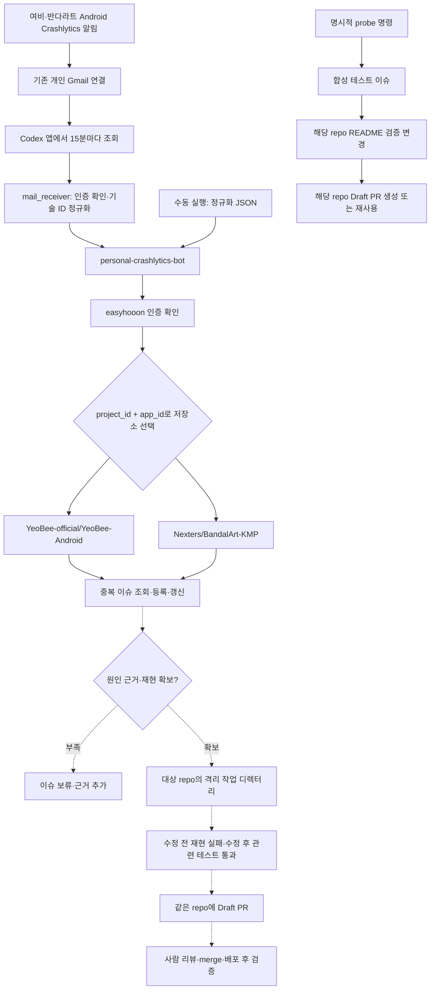

# Personal Crashlytics bot

여비·반다라트의 크래시 대응 자동화를 관리하는 전용 저장소다.

**개인 Gmail의 실제 Crashlytics 메일을 이슈 처리 코드에 연결하고 Codex 앱의 15분 수신 자동화를 활성화했다. 실제 메일 정규화/권한 검증과 최초 수신 조회는 통과했다. 예약 실행의 첫 완료와 새 알림으로 생성되는 실제 이슈는 확인 대기다. 크래시 원인 분석과 수정 PR 자동 생성은 미구현이다.**

## 확인 결과 — 2026-10-07

| 항목 | 확인 결과 |
| --- | --- |
| GitHub 쓰기 계정 | `easyhooon` |
| Firebase 계정 | 개인 운영 계정; 2026-10-06 앱 metadata·Crashlytics 읽기 HTTP 200 기록 확인. 이번에는 재조회하지 않음 |
| 이전 공통 코어 설정 | 두 target 모두 disabled; 이 저장소의 Gmail 수신기는 별도 운영 |
| GitHub 앱 저장소 workflow | 일반 CI·release·issue branch·PR 운영 workflow만 확인. 크래시 알림 처리 workflow 없음 |
| 이슈 처리 | 두 Android 앱만 허용; 기존 개인 인증으로 실제 권한 검증 통과 |
| Draft PR 처리 | 명시적으로 실행하는 합성 연결 테스트 지원; 실제 수정 PR 생성은 미연결 |
| 실제 알림 수신 | 기존 개인 Gmail 연결 → Codex 앱에서 15분 조회 → 이 저장소의 수신기 → 앱 저장소 이슈 |
| 실행 상태 | 수신 자동화 ACTIVE, 수동 최초 조회 정상/새 메일 0건; 예약 실행 첫 완료와 신규 메일 처리 대기 |
| 실제 크래시 수정 자동화 | 원인 분석, 재현/수정/test producer, 수정 PR 생성 미구현 |

기존 Crashlytics SDK 관련 이슈나 PR도 앱의 SDK 연동·수정 이력이며 이 자동화의 운영 증거가 아니다.

## 대상

| 앱 | Android Firebase project | Production app ID | GitHub 저장소 | 현재 base branch |
| --- | --- | --- | --- | --- |
| 여비 | yeobeeios | 1:434182132125:android:5f42e801adcc2624631f74 | YeoBee-official/YeoBee-Android | develop |
| 반다라트 | bandalart-e0288 | 1:197590766195:android:0e0a78d2390e6849179006 | Nexters/BandalArt-KMP | main |

여비의 project 이름에 `ios`가 있지만 표의 app ID는 Android다. 현재 확인 범위는 이 두 production Android 앱이다. iOS 크래시 대응은 별도 대상·검증을 정해야 한다. 기존 iOS 리뷰·통계·매출 알림 작업과 크래시 대응은 각각 상태를 확인한다.

## 연결할 흐름

실선은 구현한 수신/이슈 처리 경로다. 점선은 미구현 수정 경로다. 합성 PR 연결 검증은 별도 명령으로 실행한다.



운영 목표는 개인 bot이 해당 앱 저장소를 선택하고 그 저장소의 코드와 base branch를 기준으로 수정, 검증, PR을 만드는 것이다. 현재 `--probe`는 합성 테스트 이슈와 README 변경으로 Draft PR 게시 권한/경로만 검증한다. 두 저장소에 같은 원인이 확인되면 각 저장소에서 따로 검증하고 PR도 각각 만든다. 다른 저장소의 테스트 통과를 재사용하지 않는다.

## 다음 확인 순서

1. Codex 앱의 `개인 Crashlytics Gmail 수신` 자동화 첫 완료를 확인한다. 새 알림이 없으면 조용히 종료한다.
2. 다음 실제 Android 알림의 이슈 등록/재수신 결과를 확인한다. PRD 테스트 크래시는 발생시키지 않는다.
3. 기존 수동 이슈는 정확히 같은 Firebase project/package/issue 링크가 있으면 재사용한다. 복수 일치와 닫힌 이슈는 보류한다. 링크가 없는 수동 이슈는 자동 매칭 범위 밖이다.
4. 각 앱의 개발 정책에 맞게 실제 원인 근거, 재현, 수정 전/후 테스트를 연결한다. 근거가 부족하면 수정 PR을 보류한다.
5. 계정, 대상 원격, 테스트한 head, 기존 PR을 검증한 뒤 실제 수정 Draft PR을 게시한다.

## 운영 경계

회사 프로젝트·설정·인증·사내 원문·회사 bot 소스는 이 저장소에 복사하지 않았다. 연결 검증은 두 앱 저장소에 합성 테스트 이슈, 별도 branch의 README 변경, Draft PR을 만든다. 개인 Gmail 수신 자동화만 15분 간격으로 추가했다. 앱 소스 코드, 회사 일정, runner, Firebase 권한은 변경하지 않았다. PRD 테스트 크래시도 발생시키지 않았다.

공식 API 권한을 fine-grained token으로 준비하는 경우 이슈에는 두 저장소의 Issues write, 코드 branch push에는 Contents write, Draft PR에는 Pull requests write가 필요하다. 실제 연결에 맞춰 최소 범위만 승인받아 사용한다. 토큰·로그·실제 stack은 Git에 올리지 않는다.

## 실행과 테스트

Python 3와 기존 개인 계정으로 로그인한 GitHub CLI가 필요하다. 계정 전환 없이 `easyhooon`의 기존 인증을 자식 프로세스에만 사용한다. 전달된 `GH_TOKEN`이 다른 계정이면 쓰기 전에 중단한다.

```bash
python3 -B -m unittest -v
python3 -B bot.py --alert-file /absolute/path/alert.json --dry-run
python3 -B bot.py --alert-file /absolute/path/alert.json
```

동일한 정확한 Firebase 이슈 링크가 있는 수동 이슈도 사람이 남긴 본문을 보존하며 재사용한다. 메일처럼 버전 정보가 없는 입력은 이미 확인한 release 값을 덮어쓰지 않는다.

알림 JSON은 `project_id`, `app_id`, 32자리 소문자 hex `issue_id`, 선택적 `release`만 받는다. 저장소, 명령, 메일 원문과 추가 필드를 거부한다. 같은 project/app/issue는 하나의 이슈로 처리한다. release 갱신은 bot의 관리 영역만 바꾸고 사람이 남긴 내용은 보존한다. 닫힌 이슈와 중복 marker는 자동 수정하지 않는다. 라벨과 댓글은 추가하지 않는다.

```json
{
  "project_id": "yeobeeios",
  "app_id": "1:434182132125:android:5f42e801adcc2624631f74",
  "issue_id": "aaaaaaaaaaaaaaaaaaaaaaaaaaaaaaaa",
  "release": "connectivity-test"
}
```

위 JSON은 합성 예제다. 실제 앱 이슈 생성을 원하지 않으면 `--dry-run`만 실행한다. 실제 알림에는 실제 Crashlytics issue ID를 사용한다.

PR 게시 검증 명령은 **해당 앱 저장소에 쓰기**를 수행한다. 실제 장애 수정 성공을 의미하지 않는다.

```bash
python3 -B bot.py --probe yeobee
python3 -B bot.py --probe bandalart
```

각 명령은 합성 테스트 이슈, 기본 branch에서 분기한 branch, README 안내 변경, Draft PR을 만든다. 동일 테스트를 재실행하면 기존 PR을 재사용한다. 실패가 PR 생성 전 발생하면 기존 branch/README 변경으로 재개한다. 검증용 PR은 병합하지 않는다. 여비는 이슈 번호 branch와 PR 템플릿을 보존한다. 검증용 Draft에는 리뷰 요청을 수동으로 보내지 않는다. 여비의 기존 PR CI/라벨/리뷰 배정 workflow가 실행될 수 있고 반다라트 Android CI는 Markdown 변경을 제외한다.

운영 한계: 단일 Mac 프로세스 lock과 최대 10,000건의 원격 조회를 사용한다. 두 번째 실행 호스트를 활성화하기 전 공유 작업 큐가 필요하다. 기존 개인 Gmail 연결과 기존 개인 GitHub 인증으로 동작하며, 예약 실행의 첫 완료와 새 알림의 실제 처리 결과는 대기 중이다. 원인 분석, 수정 코드 생성, 앱의 재현/회귀 테스트와 실제 수정 PR 게시는 아직 구현하지 않았다.

## 실제 검증 결과 — 2026-10-07

로컬 기능 테스트 7개 통과: 두 앱의 이슈 생성/재수신/갱신과 사람 메모 보존, 닫힌 이슈 보류, 계정/입력 제한, dry-run 무쓰기, 중복 이슈 보류, Draft PR 생성/재사용, PR 생성 전 실패 후 재개. 기존 개인 인증으로 두 앱에 대한 실제 `--dry-run` 권한 검증도 통과했다.

실제 PR 게시 및 재실행 결과는 아래에 기록한다. 앱 크래시를 재현하거나 수정한 결과와 구분한다.

| 앱 | 합성 이슈 | 실제 Draft PR | 실제 검증 |
| --- | --- | --- | --- |
| 여비 | [#555](https://github.com/YeoBee-official/YeoBee-Android/issues/555) | [#556](https://github.com/YeoBee-official/YeoBee-Android/pull/556) | 작성자 easyhooon, base develop, README만 변경, 커밋 1개, 재실행 시 동일 PR 재사용 |
| 반다라트 | [#421](https://github.com/Nexters/BandalArt-KMP/issues/421) | [#422](https://github.com/Nexters/BandalArt-KMP/pull/422) | 작성자 easyhooon, base main, README만 변경, 커밋 1개, 재실행 시 동일 PR 재사용 |

여비 PR의 Android CI build, 라벨, 담당자 workflow가 모두 성공했다. 반다라트의 Markdown 변경에는 CI check가 생성되지 않았다. 이 결과를 앱 빌드/테스트 통과로 표시하지 않는다. 두 Draft PR과 합성 이슈는 검증 증거로 열어 두었다. 테스트 종료 후 PR을 병합 없이 닫고 합성 이슈와 테스트 branch를 정리한다.

## Gmail 수신 운영 — 2026-10-07

개인 Gmail에서 Firebase가 보낸 실제 여비/반다라트 Android 메일을 확인했다. 새 Gmail 인증이나 GitHub token, runner 설치, Firebase 설정 변경 없이 기존 연결을 사용한다. 수신 자동화 이름은 `개인 Crashlytics Gmail 수신`이고 Codex 앱에서 15분마다 이 로컬 대화를 실행한다. Mac이 켜져 있고 Codex 앱이 실행 중이며 기존 연결/인증을 사용할 수 있어야 한다. 앱의 자동화 카드에서 상태를 확인하거나 일시 중지한다. 예약 실행은 Codex 사용량을 소비한다.

Firebase가 기존에 보내는 이메일 알림이 입력이다. 모든 개별 크래시를 조회하는 기능은 아니다. 알림 종류와 설정은 [Firebase 공식 알림 문서](https://firebase.google.com/docs/crashlytics/alerts)를 따른다. 이번 작업은 Firebase 알림 설정을 변경하지 않았다.

수신기는 Gmail API의 `full` 메시지 객체를 입력으로 받는다. Firebase 발신 주소와 Gmail의 DKIM/DMARC 성공 결과를 확인한 뒤 두 production Android 앱의 정확한 Firebase console 이슈 URL만 정규화한다. 메일의 명령은 실행하지 않고 stack/사용자 정보/메일 원문을 GitHub 이슈에 전송하지 않는다. dev와 iOS, 다른 project, 발신자 인증 실패는 대상에서 제외한다. 네트워크에 공개한 webhook은 없으며 Gmail connector가 제공하는 메시지와 인증 결과를 신뢰하는 로컬 입력 경로다.

```bash
python3 -B mail_receiver.py --poll-query
python3 -B mail_receiver.py --gmail-file /private/tmp/message.json --dry-run
python3 -B mail_receiver.py --gmail-file /private/tmp/message.json
python3 -B mail_receiver.py --checkpoint SCAN_STARTED_EPOCH
```

`--poll-query`가 반환한 Gmail 연결, 기대 profile ID, 검색 query, 조회 시작 시각을 사용한다. connector profile이 일치해야 하며 모든 검색 페이지를 끝까지 읽고 메시지별 수신기를 실행한다. 모든 대상 처리에 성공한 경우에만 같은 조회 시작 시각으로 checkpoint를 갱신한다. 실패 시에는 갱신하지 않는다. [Gmail 공식 검색 문서](https://developers.google.com/workspace/gmail/api/guides/filtering)에 따라 `after:`에 epoch 초를 사용하고, 마지막 성공 조회보다 24시간 이전까지 겹쳐 검색한다. 최초 활성화 이전 메일은 자동으로 가져오지 않는다.

비공개 런타임 설정은 `var/receiver.json`, 메일 처리 기록은 `var/gmail.sqlite`다. 설정에는 기존 Gmail 연결 ID, 기대 profile ID, `start_epoch`, 성공 후 `last_scan_epoch`만 있고 인증 token은 없다. 새 Mac에서는 사용자의 기존 Gmail 연결을 확인한 뒤 이 값을 로컬에서 설정하고 자동화를 연결한다. 설정과 DB는 Git에서 제외하며 소유자만 읽고 쓴다. 처리 기록에는 Gmail 메시지 ID와 처리 시각만 저장한다. 원문을 전달하는 일회성 JSON 파일은 `/private/tmp`에 권한 0600으로 만들고 성공/실패 모두 삭제한다. company 상태/인증/runner를 공유하지 않는다.

최종 기능 테스트 **12개 통과**. 추가 검증은 실제 Gmail 응답 형태의 두 앱 정규화, 원문 배제, 수신 메시지 재처리 방지, 쓰기 실패 후 재시도, 기존 수동 이슈 링크 재사용, 버전 정보 보존, 발신자 인증, dev/iOS/다른 project 제외, 검색 시점의 겹침과 갱신이다. 실제 받은 두 Android 메일은 각각 한 이슈로 정규화하고 해당 저장소 권한을 `dry-run`으로 검증했다. 실제 최초 Gmail 조회는 정상 종료했고 활성화 이후 새 메일은 **0건**이었다. 따라서 신규 실제 크래시 이슈 등록과 예약 실행 완료를 통과했다고 표시하지 않는다.
